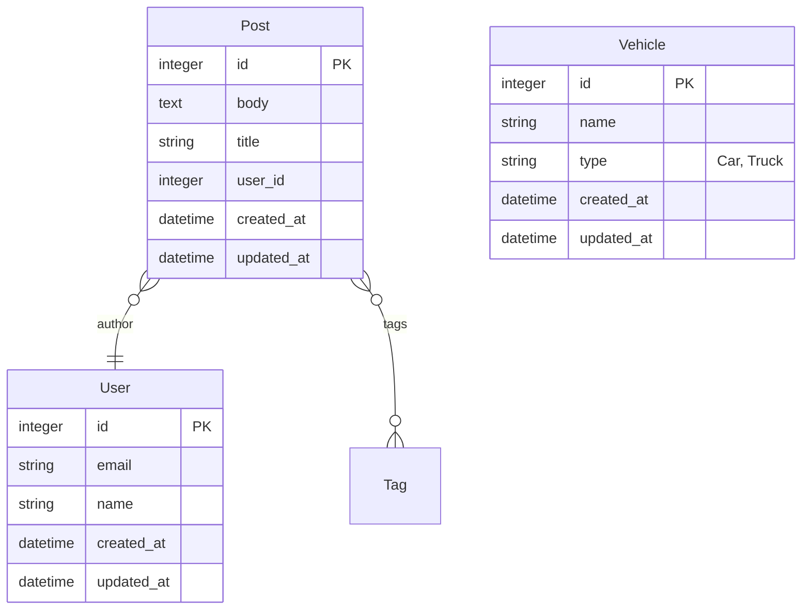

# schemerd

Auto-generate [Mermaid](https://mermaid.js.org/) ER diagrams from your ActiveRecord models. Keeps your schema documentation in sync by regenerating after every migration.

## Installation

Add to your Gemfile:

```ruby
group :development do
  gem "schemerd"
end
```

Run `bundle install`.

## Usage

### Generate the diagram

```bash
rake schemerd:generate
```

This creates `docs/erd.md` with a Mermaid `erDiagram` block containing all your models, columns, and associations.

### Auto-generate on migrations

By default, Schemerd hooks into `db:migrate`, `db:migrate:up`, `db:migrate:down`, and `db:migrate:redo` in development. The diagram regenerates automatically after each migration.

To disable this:

```ruby
Schemerd.configure do |config|
  config.auto_generate = false
end
```

## Configuration

Generate an initializer with all available options:

```bash
rails generate schemerd:install
```

This creates `config/initializers/schemerd.rb`. Available options:

```ruby
Schemerd.configure do |config|
  # Output directory relative to Rails.root (default: "docs")
  config.output_directory = "docs"

  # Output filename (default: "erd.md")
  config.output_filename = "erd.md"

  # Header text at the top of the generated file
  config.header = "# Entity Relationship Diagram\n\nAuto-generated. Do not edit manually."

  # Model name prefixes to exclude from the diagram (default: [])
  config.excluded_prefixes = ["Flipper::", "Ahoy::"]

  # Automatically regenerate after migrations (default: true)
  config.auto_generate = true

  # Base class for model discovery (default: "ApplicationRecord")
  config.base_class = "ApplicationRecord"
end
```

## Features

- **Consistent column ordering** — PK first, then alphabetical, timestamps (`created_at`, `updated_at`) last
- **STI support** — child models are filtered out; the `type` column is annotated with subclass names (e.g. `string type "Car, Truck"`)
- **All association types** — `belongs_to`, `has_many`, `has_one`, and `has_and_belongs_to_many`

## Output Example

The generated file contains a fenced Mermaid code block:

~~~markdown
# Entity Relationship Diagram

Auto-generated from ActiveRecord models. Do not edit manually.


~~~

Render it on GitHub, GitLab, or any Mermaid-compatible viewer.

## License

MIT License. See [LICENSE.txt](LICENSE.txt).
